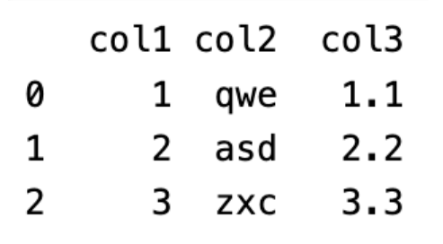

Задание №1  
Написать класс для работы с датасетом.  

Класс Dataset должен принимать путь до файла с данными (например, Dataset(“./test_data.csv”)) и хранить их в динамической памяти в формате таблицы. Структура хранения данных должна быть написана вами, а не взята из какой-либо библиотеки.     

Пример того, как стоит представлять данные:

Описание файла с данными:   
1. Входной файл может быть в формате .csv или .txt     
2. Каждый столбец хранит определенный тип данных и только один. Столбцы могут быть как численных типов, так и символьных (строки)   
3. В файле с данными первой строкой могут быть указаны названия столбцов. На случай, если названия столбцов не указаны необходимо добавить возможность передать их отдельным аргументом при создании экземпляра класса.     
4. Аналогично в файле может быть или не быть первый столбец, обозначающий индекс объекта (можно интерпретировать его как номер строки в таблице). Если его нет в файле, то нужно добавить аргумент типа bool, отвечающий за его создание

Поля, которые должен содержать Dataset: 
* Поле data, хранящее указатель на данные
* Поле size, хранящее размер датасета

Методы, которые должен содержать Dataset:
1. Метод head(int n), который выводит первые n строк таблицы на печать (важно не забыть про названия столбцов и индексы, они тоже должны быть выведены). Если не передавать аргумент в метод head(), то на печать выводятся первые 5 строк таблицы или менее, если строк в таблице < 5. 
2. Метод tail(int n), аналогично методу head(), только данные берутся с конца таблицы 
3. Метод insert, добавляющий новую строку в таблицу по индексу
4. Метод remove, удаляющий строку по индексу из таблицы
5. Метод describe, в который передается название столбца, для которого считаются следующие статистические величины:
    * Максимальное значение
    * Минимальное значение
    * Среднее значение
    * Стандартное отклонение        

    Результат работы метода выводится на печать
6. Метод, перегружающий оператор [ ], который выводит строку по индексу или элемент по двум индексам. Например, dataset[0] выведет первую строку, а dataset[0][0] первый элемент первой строки

Также необходимо протестировать получившийся код
 
Требования: 
установлены
- утилита CMake
- фреймворк gtest

Запуск на Bash: в папке проекта написать команду "cmake CMakeLists.txt", затем "make", запустить программу "test".